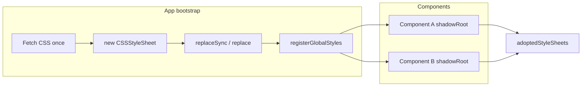

# Reactive HTML v2 Plan (Opus-style)

## Executive summary

ReactiveHTML v2 will satisfy [Spec.md](Spec.md) by: (1) making dynamic data in the template update reliably using the existing template function and the `:` binding convention; (2) leaning on standard Web Component APIs and trimming custom machinery; (3) replacing per-root stylesheet cloning with Constructable Stylesheets and `adoptedStyleSheets`; (4) making child/dependent components define and become "ready" before parents use them, with an explicit dependency model; and (5) adding TypeScript support via types and optional TS source. The plan is phased so each phase builds on the previous and remains shippable.

---

## 1. Dynamic data properties and the `:` binding system

### 1.1 Problem

The spec requires "a system for updating dynamic data properties render in the template" with ":" for binding and a solution that either uses the current templating function or a more practical, dev-friendly one (vanilla JS, optional syntactic sugar).

Today:

- The template is a function that returns a string; it is not re-invoked when internal state changes.
- A data Proxy only calls `updateDataBind(dataProp, value)`, which updates elements that have `[\:text="dataProp"]`. No other nodes are updated.
- So only `:text` bindings are "reactive"; everything else (e.g. `${this.data.myTitle}` in the template) stays stale until `this.render()` is called manually.

So "dynamic data properties in the template" is only partially implemented and is easy to misuse.

### 1.2 Design constraints

- Vanilla JS first: no required compiler or build step for core behavior.
- Keep ":" as the single binding character (props on the host and data in the template).
- Prefer reusing the current template function API; avoid a second, incompatible templating system in the same codebase.

### 1.3 Options and recommendation

**Option A — Auto-render on data change**

- When the data Proxy's `set` trap runs (and the value actually changes), call `this.render()` after updating the target.
- Effect: any dynamic data expressed in the template (e.g. `${props.name}`, `${data.items.length}`) updates whenever that data changes, with no new syntax.
- Pros: Minimal API change, satisfies "dynamic data in template," no new concepts.
- Cons: Full template re-run and DOM replace on every change; more work for large templates or frequent updates. Mitigate with a microtask/scheduler so multiple synchronous updates result in one render.

**Option B — Fine-grained bindings only**

- Extend the current binding system: add more binding types (e.g. `:text`, `:html`, `:attr`, `:class`, `:style`) and update only those nodes when the corresponding data key changes. The template function still runs once (or on explicit `render()`); bindings are the only reactive parts.
- Pros: Fewer full re-renders, predictable update surface.
- Cons: More implementation surface, more rules for developers, and interpolated expressions in the template string (e.g. `${data.x}`) still would not update unless we also re-run the template or introduce an expression layer.

**Option C — Hybrid (recommended)**

- **Default (MVP):** Option A — auto-render on data change, with a single microtask (or similar) to batch rapid updates. This delivers "dynamic data in template" immediately and keeps the mental model simple.
- **Stability:** Ensure `render()` is safe when called repeatedly: re-attach listeners correctly, avoid double registration, and fix v1 bugs (e.g. `$rel.slots` is used but never initialized; either initialize `$rel.slots = []` or remove slots logic that depends on it).
- **Later:** Option B can be added as an optimization: allow optional "binding-only" updates for specific keys so that for high-churn data we update only `[\:text="key"]` (and future binding types) without a full re-render. The spec's ":" convention is then the single binding syntax for both the full-render and fine-grained paths.

### 1.4 Implementation outline

1. In the data Proxy `set` trap, after assigning to `target[dataProp]`, schedule a single `this.render()` (e.g. via `queueMicrotask` + a "dirty" flag so one render per microtask).
2. Ensure `render()` / `renderTemplate()` + listener setup/teardown and MutationObserver logic behave correctly under repeated calls (no duplicate listeners, no leaking observers).
3. Fix `$rel.slots`: initialize `slots: []` in `$rel` or remove code that uses `this.$rel.slots`.
4. Document: ":" is the binding character — `:propName` on the host for props, and in-template bindings (e.g. `:text="key"`) for reactive data; full template re-runs on data change unless we add optional fine-grained bindings later.

---

## 2. Rely on the Web Component API

### 2.1 Problem

The spec asks to rely on the Web Component API as much as possible and avoid heavy custom implementation.

Current use of standards is already substantial: Custom Elements, Shadow DOM, `observedAttributes` / `attributeChangedCallback`, `CustomEvent`, native `<slot>`, and `customElements.whenDefined`. The main custom pieces are: internal `$rel` state, name normalization for `:attr` / `@attr`, manual attachment/removal of `@` action listeners, a MutationObserver to re-attach after render, and cloning document styles into each shadow root.

### 2.2 Direction

- **Attributes:** Keep using `observedAttributes` and `attributeChangedCallback` for `:propName`. Continue deriving `observedAttributes` from the declared `props` so developers don't maintain a separate list.
- **Events:** Keep `dispatchEvent` + `CustomEvent` with `bubbles`/`composed` for `@` actions. No custom event bus.
- **Slots:** Use only the native `<slot>` contract. Fix or remove any `$rel.slots` logic so it doesn't rely on uninitialized state.
- **Shadow DOM:** One open shadow root per component; no virtual-DOM or non-shadow abstraction.
- **Lifecycle:** Stick to standard hooks (`constructor`, `connectedCallback`, `disconnectedCallback`, `attributeChangedCallback`). Map framework hooks (`preRender`, `postRender`, `propsUpdate`) clearly in docs to these standard points.
- **Surface area:** Prefer standard DOM (e.g. `this.shadowRoot.querySelector`) over custom helpers unless they add real value. Keep `encodeAttributeValue` / `parseAttributeValue` for `:` prop serialization across the shadow boundary.

A short "Web Component alignment" section in the README will state that v2 follows standard Custom Elements, Shadow DOM, slots, and DOM events, and list what is custom (e.g. `:props`, `@actions`, and the reactive data/rendering contract).

---

## 3. Styling: performant external stylesheets

### 3.1 Problem

The spec calls for a better, more performant way to style Web Components with external stylesheets.

Current approach in `modules/reactive-html/index.js` (`setLinksAndStyles`): clone every `document` stylesheet (and font preload) link into each component's shadow root inside a hidden div. Consequences: N shadow roots imply N copies of every stylesheet link; cloning links can cause duplicate requests or cache quirks; and the approach doesn't scale.

### 3.2 Standard-based solution: Constructable Stylesheets

Use [Constructable Stylesheet Objects](https://developers.google.com/web/updates/2019/02/constructable-stylesheets) and `shadowRoot.adoptedStyleSheets`:

- One or more `CSSStyleSheet` instances are created from external CSS (fetch once, then `sheet.replaceSync(cssText)` or `sheet.replace(cssText)`).
- Each shadow root receives the same sheet references: `this.shadowRoot.adoptedStyleSheets = [sheet1, sheet2, ...]`. No cloning of `<link>` nodes; no duplicate network loads.

Flow:

- **API:** Provide a small helper, e.g. `registerGlobalStyles(cssText | string[])` or `registerGlobalStyles(urls: string[])`, that returns `CSSStyleSheet[]`. Components (or a base class) set `this.shadowRoot.adoptedStyleSheets = [...globalSheets, ...componentSheets]`. Optionally allow per-component sheets (e.g. from a `styles` option).
- **Fallback:** If `adoptedStyleSheets` is unsupported (legacy browsers), document that v2 assumes support, or provide a fallback that injects a single `<link rel="stylesheet">` per shadow root (one link per root, not N clones of all links).
- **Migration:** Remove `setLinksAndStyles` and the hidden link container. Document the new styling model and any bootstrap required (e.g. call `registerGlobalStyles` with app styles before defining components).

---

## 4. Child and dependent components; readiness

### 4.1 Problem

The spec wants child/dependent components to render first and the parent to wait until they are ready. It suggests requiring the developer to import dependent components so the framework can await them.

Current behavior: the default export IIFE collects all custom element tags in `document.body`, awaits `customElements.whenDefined(tagName)` for each, then clears `body.className`. So the app waits for "all tags present in the DOM" to be defined, but there is no notion of "parent waits for its children" or of declaring dependencies. Components are usually registered in one place before first paint, with no explicit ordering.

### 4.2 Dependency model

- **Explicit registration order:** Document that any component that uses a child tag (e.g. `<my-child>`) must have that child **imported and defined first** (e.g. `import Child from './Child'; customElements.define('my-child', Child);`). This keeps dependencies explicit and avoids undefined custom elements.
- **Parent waits for children:** When a parent's template is rendered and contains custom elements, the parent can consider itself "ready" only after those children are defined (and optionally after they have completed their first render).

### 4.3 Options for "ready"

**Option A — Defined only**

- After appending child elements to the shadow root, the parent awaits `Promise.all([...childElements].map(el => customElements.whenDefined(el.tagName.toLowerCase())))`. "Ready" means "child custom elements are defined." No new protocol.

**Option B — Defined + "ready" promise**

- Each component can expose something like `element.ready` (a Promise that resolves after first `connectedCallback` and first render). Parent awaits both `whenDefined` and `child.ready` for each child. Gives "child has rendered" semantics at the cost of a small protocol.

Recommendation: **Phase 1 — Option A** (parent waits for children to be defined). Option B can be added later if you need "child has rendered" before parent's `postRender` or similar.

### 4.4 Top-level bootstrap

- Provide a small bootstrap that, after DOM is ready, discovers the tree of custom elements (including inside shadow roots) and awaits `customElements.whenDefined` for every unique tag name, then resolves a "whenReady" promise or runs a callback. This replaces or refines the current default export IIFE.
- **API:** e.g. `whenReady(): Promise<void>` that walks the DOM (and open shadow roots), collects tag names, awaits all `whenDefined`, then resolves. Export it so the app can `await whenReady()` before treating the page as ready.
- **Documentation:** "Component dependencies" section: (1) import and define children before parents, (2) parents wait for child tags to be defined (and optionally "ready") before considering render complete, (3) how to use `whenReady()` in the app entry point.

---

## 5. TypeScript support

### 5.1 Goal

The spec asks for TypeScript support.

### 5.2 Approach

- **Types first:** Add TypeScript declaration files (e.g. `index.d.ts`) for the public API: `createReactiveElement` options (name, template, props, data, methods, lifecycles, components, triggers), template context (props, data, encodeAttributeValue, etc.), and lifecycle signatures. The library can remain JavaScript; consumers get type checking and editor support.
- **Optional:** Migrate `modules/reactive-html/index.js` to TypeScript (e.g. `index.ts`), add a build step (tsc or bundler), and emit `index.js`. Then the package can ship both JS and types from source.
- **Package:** In `modules/reactive-html/package.json`, set `"types": "index.d.ts"` (or the built declaration path). If a build step is added, add a `build` script and point `main` to the built output.
- **Consumers:** Document usage from both TypeScript and vanilla JS; show a minimal TS example with typed props/data.

---

## 6. Phased implementation order

Dependencies between items:

1. **TypeScript and types** — Add `.d.ts` (and optionally convert source to TS). Enables safer refactors and documents the API. No dependency on other v2 features.
2. **Styling** — Replace `setLinksAndStyles` with `adoptedStyleSheets` and a `registerGlobalStyles`-style API. Removes a major performance and correctness concern before changing render behavior.
3. **Dynamic data and ":" binding** — Implement auto-render on data change (Option A), fix `$rel.slots` and render/listener bugs, document ":" as the binding character. Core reactivity improvement.
4. **Web Component alignment** — Trim and document use of standard lifecycle and DOM; minimal custom surface. Can be done in parallel with or after (3).
5. **Dependency and readiness** — Document import/define order; implement parent wait for child `whenDefined`; add `whenReady()` (or equivalent) and update default export/docs. Builds on a stable render and styling story.

Suggested execution order: **1 → 2 → 3 → 4 and 5** (4 and 5 can be parallelized after 3).

---

## 7. Non-goals for v2 MVP

- No new templating language or compiler; stay with template function + optional binding attributes.
- No breaking change to the shape of `createReactiveElement` options beyond additive changes (e.g. optional `styles`, `dependencies`).
- No removal of `:props` or `@actions`; keep and clarify them under the ":" binding story.
- No polyfills for Constructable Stylesheets in the core package; document browser support or provide a separate compatibility layer if needed.

---

## 8. Summary table

| Spec item | Approach |
|-----------|----------|
| Dynamic data in template, ":" binding | Auto-render on data change (Option A), batched; fix slots and render safety; document ":" convention; optional fine-grained bindings later (Option B). |
| Web Component API | Use standard Custom Elements, Shadow DOM, slots, events; reduce and document custom surface; fix slots init. |
| External stylesheets | Replace link cloning with Constructable Stylesheets + `adoptedStyleSheets`; `registerGlobalStyles`-style API; remove `setLinksAndStyles`. |
| Child/parent readiness | Require import/define order; parent waits for child tags via `whenDefined`; optional `whenReady()` bootstrap; document dependency model. |
| TypeScript | Add `.d.ts`; optionally convert source to TS and add build. |
